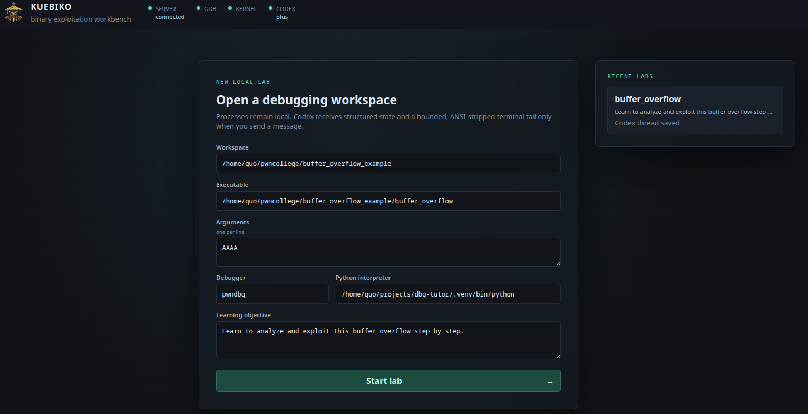
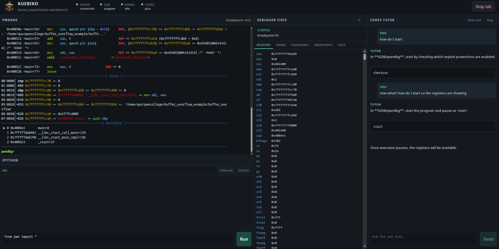

<p align="center">
  
</p>

# Kuebiko

A fast, local-first binary-exploitation learning workbench. Kuebiko combines a real pwndbg terminal, structured GDB state, persistent IPython execution, and an observer-only Codex tutor in one browser window.

The name comes from Kuebiko, the wise scarecrow deity of Japanese mythology: unable to walk, yet possessing knowledge of everything in the world. That makes it a fitting namesake for an observer that understands your debugging session without taking control of it.

## Showcase

### Start or resume a local lab



### Debug with pwndbg, structured state, IPython, and the Codex tutor



## What it runs

- SolidJS, TypeScript, Vite, and xterm.js in the browser.
- Rust, Tokio, and Axum on loopback.
- pwndbg in a PTY for the human interface, plus a second GDB/MI UI for registers, frames, disassembly, breakpoints, and stack bytes.
- ipykernel through the Jupyter messaging protocol. A small Python bridge uses `jupyter_client`; terminal output is never scraped.
- `codex app-server` over JSONL JSON-RPC. The tutor receives structured state and a bounded, ANSI-stripped tail of the pwndbg terminal only when you send a chat message, so it can recognize commands and output you already saw. It is configured read-only, with approvals disabled, and cannot operate your debugger or kernel.

## Setup

Requirements: Linux x86-64, Rust stable, Node.js/npm, `uv`, `gdb`, `pwndbg`, and a logged-in Codex CLI.

```sh
uv sync
npm --prefix web install
npm --prefix web run build
cargo run --release
```

The server prints a tokenized `http://127.0.0.1:7878/` URL. Open that exact URL. The token and same-origin check prevent unrelated pages from opening the local WebSocket. The service listens on loopback only.

The launch form defaults to the included development environment's buffer-overflow example. Change the workspace, executable, pwndbg command, Python executable, arguments, and learning objective as needed. The Python executable must have `ipykernel`, `jupyter_client`, and any packages you want in notebook cells; `uv sync` creates a suitable `.venv` for this repository.

Only one lab runs at a time. Starting or resuming another lab stops the managed pwndbg and kernel children. Recent lab metadata and its Codex thread ID are stored atomically under the platform XDG state directory (normally `~/.local/state/kuebiko/state.json`) with owner-only permissions.

## Lab journals and writeups

Kuebiko automatically creates a durable journal for each lab under `~/.local/share/kuebiko/labs/<lab-id>/`. The journal includes timestamped pwndbg input and ANSI-stripped output, structured GDB/MI snapshots, IPython activity, Codex conversation events, and lab lifecycle events:

```text
<lab-id>/
├── manifest.json
├── events.jsonl
└── writeup.md      # created on request
```

Select **Writeup** in the Codex tutor header to explicitly send up to the latest 2 MiB of journal data to Codex. Kuebiko generates a chronological Markdown blog draft, redacts local home-directory prefixes and apparent secrets, and saves it as `writeup.md`. Raw journal data remains separate and is not sent for writeup generation until you press the button.

## Development

Build the frontend before running the Rust server, or run both processes while working on the UI:

```sh
npm --prefix web run dev
cargo run
```

Checks:

```sh
cargo fmt --all -- --check
cargo clippy --all-targets -- -D warnings
cargo test
npm --prefix web test
npm --prefix web run build
```

## Message boundary

The browser uses one WebSocket. Binary frames begin with channel byte `1` and contain raw pwndbg PTY bytes. All control traffic and structured state use versioned JSON envelopes. The backend validates executable and workspace paths, bounds terminal replay and learning context, and never passes shell strings to a shell.

This tool is intended for programs and systems you own or are explicitly authorized to analyze.
